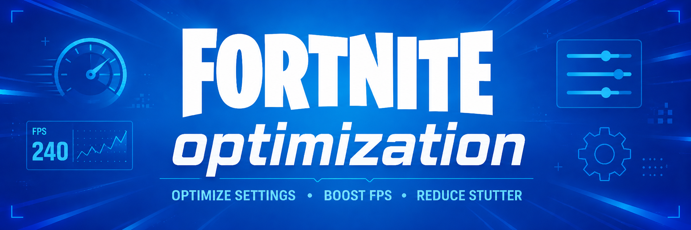
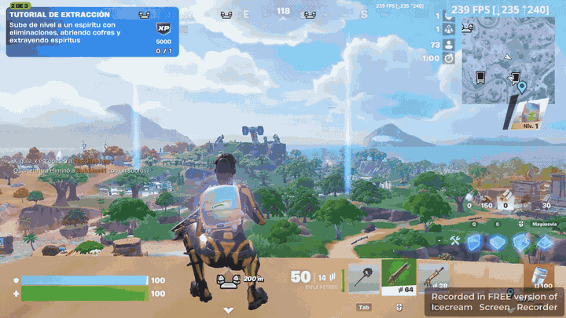

<p align="center">
  
</p>

# Fortnite Optimization

Skill abierta para auditar, diagnosticar y optimizar Fortnite en Windows con evidencia, mediciones comparables y cambios reversibles.

Los servicios y programas de optimización para gaming suelen ser caros y muchas veces aplican ajustes difíciles de comprobar. **Fortnite Optimization** nació como una alternativa gratuita y transparente, construida durante semanas de trabajo, investigación, pruebas reales y comparaciones antes/después.

No es un paquete de “tweaks mágicos”: primero busca la causa de los bajones de FPS, stuttering, input delay o ping; luego propone cambios y valida si realmente mejoraron el equipo.

## Qué revisa

- FPS, frametimes, 1% lows, stuttering y cuello de botella del game thread.
- CPU, GPU, temperaturas, clocks, potencia y utilización durante una partida.
- Módulos y ranuras de RAM, dual channel, frecuencia y XMP/EXPO.
- Ranura PCIe de la gráfica, generación/ancho del enlace y ReBAR.
- BIOS, drivers, SSD, pagefile, monitor, resolución y frecuencia de actualización.
- Windows Update, servicios, tareas de inicio, procesos en segundo plano y Windows modificados como KernelOS, AtlasOS o ReviOS.
- Performance Mode, límites de FPS, replays, overlays, streams, navegadores y emuladores.
- Ping, jitter, pérdida de paquetes, Ethernet, bufferbloat y latencia local.

## Ejemplo

El siguiente GIF muestra el contador de Fortnite durante una prueba. Es una demostración del proceso, no una promesa de una cantidad concreta de FPS: el resultado depende del hardware, Windows, la partida y la configuración.

<p align="center">
  
</p>

## Requisitos

- Windows 10 u 11 de 64 bits.
- Fortnite instalado para las pruebas dentro del juego.
- [Codex](https://openai.com/codex/get-started/) o [Claude Code](https://code.claude.com/docs/en/skills) con acceso al sistema de archivos y a PowerShell. No alcanza con usar un chat web sin acceso local al equipo.
- Windows PowerShell 5.1 o PowerShell 7.
- Conexión a Internet para verificar versiones actuales de BIOS, drivers y documentación.
- Permisos de administrador recomendados para una auditoría completa. La recopilación básica también funciona sin elevar permisos.
- Autorización del usuario para cualquier cambio que requiera reinicio, modifique seguridad o toque BIOS/firmware.

La telemetría avanzada de NVIDIA utiliza `nvidia-smi` cuando está disponible. El resto de la auditoría funciona aunque ese comando no exista.

## Instalación

Descargá o cloná el repositorio completo y conservá su estructura: `SKILL.md`, `scripts/`, `references/`, `agents/` y `assets/` deben permanecer juntos.

### Codex

Colocá la carpeta en:

```text
%USERPROFILE%\.codex\skills\fortnite-optimization
```

Abrí una sesión nueva de Codex y ejecutá:

```text
$fortnite-optimization Audita mi PC y optimiza Fortnite sin cerrar el juego.
```

### Claude Code

Colocá la carpeta en:

```text
%USERPROFILE%\.claude\skills\fortnite-optimization
```

Reiniciá Claude Code si la carpeta `skills` fue creada mientras estaba abierto y ejecutá:

```text
/fortnite-optimization Audita mi PC y optimiza Fortnite sin cerrar el juego.
```

Si utilizás Codex y Claude Code, podés clonar el repositorio una sola vez y enlazar esa misma carpeta desde ambos directorios de skills para mantener una única versión actualizada.

## Uso directo de los scripts

La skill incluye dos herramientas de solo lectura. Ejecutalas desde PowerShell indicando un directorio de salida fuera del repositorio.

Auditoría general:

```powershell
powershell -ExecutionPolicy Bypass -File .\scripts\collect-fortnite-audit.ps1 `
  -OutputDirectory "$env:USERPROFILE\Desktop\Fortnite-Audit"
```

Captura de telemetría durante 180 segundos con Fortnite abierto:

```powershell
powershell -ExecutionPolicy Bypass -File .\scripts\capture-fortnite-session.ps1 `
  -DurationSeconds 180 `
  -PingTarget 1.1.1.1 `
  -OutputDirectory "$env:USERPROFILE\Desktop\Fortnite-Session"
```

Los scripts generan informes JSON, CSV y Markdown según corresponda. No cambian la prioridad del juego, no fijan afinidades y no cierran procesos.

## Filosofía y seguridad

- Medir antes de modificar y volver a medir después.
- No cerrar Fortnite ni otras aplicaciones sin permiso.
- Mantener Performance Mode cuando el usuario lo solicita.
- No reiniciar automáticamente.
- Crear respaldos y registrar cómo revertir cada cambio.
- Evitar tweak packs, archivos `.reg` desconocidos y desactivaciones masivas de seguridad.
- No prometer aumentos de FPS: cada recomendación debe sostenerse con evidencia del equipo analizado.

Algunos pasos, como actualizar la BIOS o reparar una instalación de Windows dañada, requieren intervención manual y confirmación explícita. La skill guía el proceso, pero no elimina el riesgo inherente a modificar firmware o el sistema operativo.

## Licencia

Distribuido bajo la [licencia MIT](LICENSE). Fortnite es una marca de Epic Games; este proyecto es independiente y no está afiliado ni respaldado por Epic Games.
